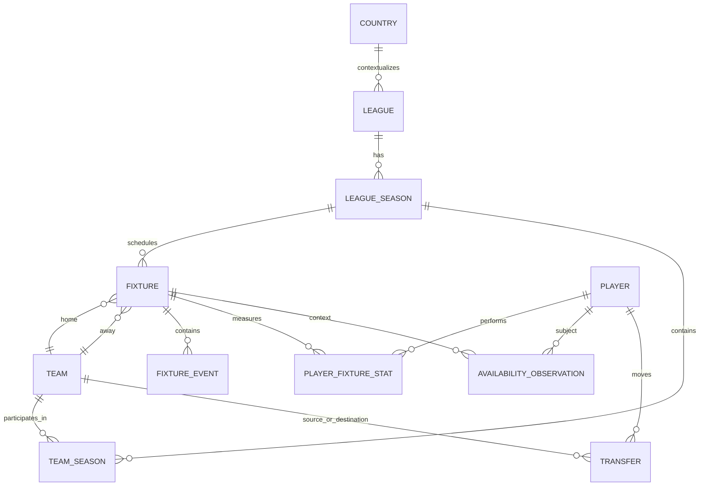

# Football Ontology

## Purpose

Define the canonical entities and relationships before mapping them to endpoint producers.

## Overview

The ontology distinguishes enduring entities (Player, Team, League), scoped entities (LeagueSeason, TeamSeason), scheduled events (Fixture), atomic observations (FixtureEvent), and provider products (OddsQuote, Prediction).

## Table of Contents

1. Core graph
2. Temporal entities
3. Evidence boundaries

## Canonical Nodes

| Node | Identity | Time model |
|---|---|---|
| Player | vendor `player.id` | enduring identity; profile may change |
| Team | vendor `team.id` | enduring organization; membership changes |
| Venue | vendor `venue.id` when present | slowly changing place |
| League | vendor `league.id` | competition identity |
| LeagueSeason | `(league_id, season)` | scoped season, not a universal year |
| Fixture | vendor `fixture.id` | scheduled then live then completed |
| Transfer | natural event key; no documented transfer ID | historical event |
| AvailabilityObservation | vendor player–fixture record | fixture-scoped observation |

## Identity Warning

The integer `season` alone is not an identity. Calendar-year and cross-year competitions share values. Always qualify it with `league_id`; when necessary also retain the vendor’s competition name and country context.
