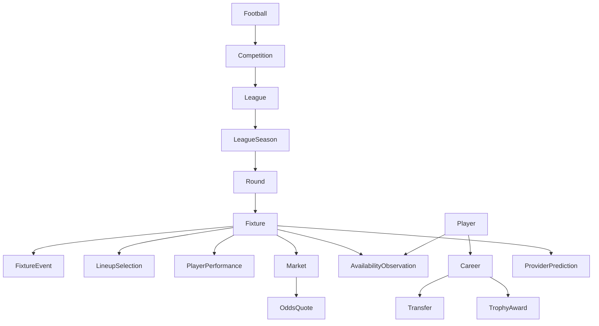

# Football Knowledge Taxonomy

## Purpose

Classify every knowledge product by domain, grain, and mutability.

## Overview

The taxonomy prevents a common warehouse error: joining a snapshot aggregate to atomic fixture facts and treating the repeated values as independent observations.

## Table of Contents

1. Competition chain
2. People and organizations
3. Match evidence
4. Provider intelligence

| Family | Examples | Mutability |
|---|---|---|
| Reference | country, timezone, bookmaker, bet | low |
| Catalogue | league, season, coverage, team | low to medium |
| Historical event | fixture, event, transfer, trophy | medium until settled |
| Snapshot | standings, team statistics, player season statistics | medium to high |
| Live | fixture status, events, live odds | high |
| Assessment | prediction, odds | provider- and retrieval-time dependent |
