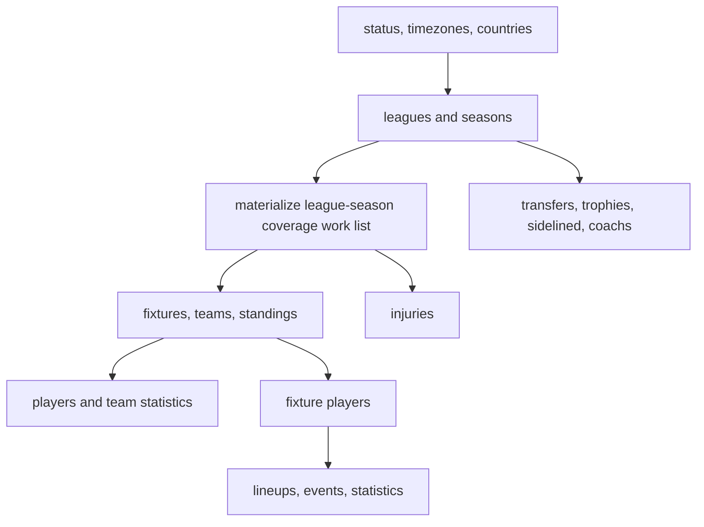

# Cold Start

## Purpose

Acquire the maximum useful knowledge from an empty cache while retaining a reproducible work list.

## Overview

Discovery precedes detail. Download catalogue facts once, derive eligible league-season pairs from coverage, then obtain fixtures before fixture-addressed enrichments.

## Table of Contents

1. Discovery
2. Spine
3. Enrichment

## Ordered Strategy

1. Cache service status separately from football facts; it describes access, not the domain.
2. Fetch countries, timezones, leagues, and seasons. Materialize every `(league_id, season)` with relevant coverage flags.
3. Fetch fixtures for each selected league-season. This establishes fixture IDs, dates, teams, rounds, and the address space for detail endpoints.
4. Fetch teams and standings for the same scopes. Then obtain player season statistics and team statistics where coverage and quota justify them.
5. Fetch `/injuries` as its own availability spine. It is not a replacement for fixtures.
6. Enrich fixtures in value order: player performances, lineups, events, then team match statistics.
7. Crawl career/history endpoints independently; do not let an incomplete fixture archive erase transfer or trophy evidence.

## Operational Controls

Use canonical cache keys `(endpoint, sorted parameters)` or the repository’s appropriate scoped file paths. Write only successful and semantically empty answers; never cache authentication, plan, or quota failures. Log response headers, endpoint version evidence, request parameters, retrieval time, payload hash, and outcome.
