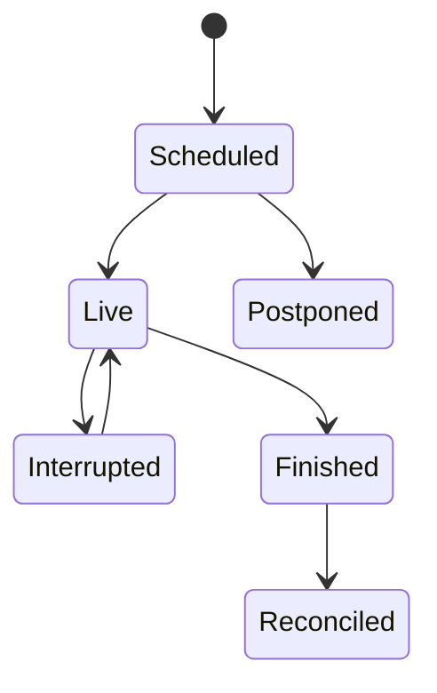

# Live Updates

## Purpose

Define safe polling behavior for facts that change while fixtures are active.

## Overview

Live processing is a revision stream built from polling snapshots. It needs a fixture state machine and a final reconciliation pass, not a single “live score” table overwrite.

## Table of Contents

1. Active set
2. Polling
3. Settlement

## Policy

Discover the active set from the fixture service and its documented statuses. Poll fixture state and events at the provider’s recommended live cadence; poll lineups close to kickoff; treat odds as independent timestamped quotes. On a terminal status, re-fetch all required details after a delay and again in a short reconciliation window. Do not infer finality solely from elapsed wall-clock time.

## Failure Recovery

Persist the last successful response per fixture-detail endpoint. If quota, plan, or auth errors occur, record the access failure without replacing the prior domain snapshot. Resume from the set of missing or stale fixture-endpoint pairs.
