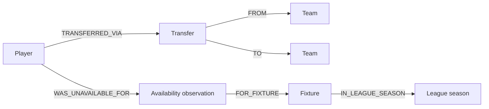

# Football Ontology Reference

## Purpose

Provide a compact, implementation-neutral vocabulary for relational and graph models.

## Overview

Each predicate has a direction, time semantics, and evidence source. Use event nodes when the relationship itself has attributes or must be versioned.

## Table of Contents

1. Node labels
2. Edge types
3. Constraints

| Label | Required identity | Key edges |
|---|---|---|
| `Player` | `api_id` | `PLAYED_IN`, `SELECTED_FOR`, `TRANSFERRED_VIA`, `WAS_UNAVAILABLE_FOR` |
| `Team` | `api_id` | `HOSTED`, `VISITED`, `USES_VENUE`, `EMPLOYS` |
| `Fixture` | `api_id` | `IN_LEAGUE_SEASON`, `HAS_EVENT`, `HAS_MARKET` |
| `LeagueSeason` | `league_id`, `season` | `HAS_FIXTURE`, `HAS_STANDING_SNAPSHOT` |
| `Transfer` | derived immutable key | `OF_PLAYER`, `FROM`, `TO` |
| `AvailabilityObservation` | retained source record key | `OF_PLAYER`, `FOR_FIXTURE`, `AT_TEAM` |

## Constraints

- `Player.api_id`, `Team.api_id`, and `Fixture.api_id` are unique per vendor namespace.
- A `Fixture` has at most one home and one away `Team` in a response revision.
- A `Transfer` must retain source and destination nullability; do not invent a club for unknown values.
- `AvailabilityObservation` is not equivalent to `InjurySpell`.
