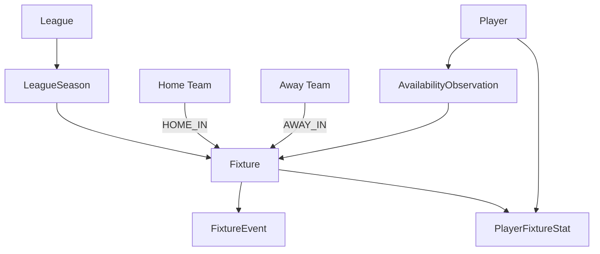

# Graph Warehouse Schema

## Purpose

Specify a Neo4j-oriented property graph that complements the relational source of truth.

## Overview

Use nodes for entities and reified observation nodes for relationships with source, time, type, or revision attributes. This avoids overwriting history on direct edges.

## Table of Contents

1. Labels
2. Relationships
3. Traversals



| Label | Uniqueness constraint | Important properties |
|---|---|---|
| `Player`, `Team`, `League`, `Venue`, `Fixture` | `source`, `api_id` | name, source timestamps |
| `LeagueSeason` | `source`, `league_id`, `season` | coverage flags |
| `FixtureEvent`, `Transfer`, `AvailabilityObservation` | `source`, retained/derived key | occurrence/retrieval times, raw type |
| `StandingSnapshot`, `OddsQuote`, `PredictionSnapshot` | source scope + retrieved time | snapshot values |

## Recommended Relationships

`(:Fixture)-[:IN_LEAGUE_SEASON]->(:LeagueSeason)`, `(:Team)-[:HOME_IN]->(:Fixture)`, `(:Player)-[:HAS_PERFORMANCE]->(:PlayerFixtureStat)-[:IN_FIXTURE]->(:Fixture)`, `(:Player)-[:HAS_AVAILABILITY]->(:AvailabilityObservation)-[:FOR_FIXTURE]->(:Fixture)`, and `(:Transfer)-[:OF_PLAYER|FROM|TO]->(:Player|:Team)`.

## Traversals

```cypher
// Evidence, not assumed membership: player appearances for a club in a period.
MATCH (p:Player {api_id: $player_id})-[:HAS_PERFORMANCE]->(s)-[:IN_FIXTURE]->(f:Fixture)
MATCH (p)-[:HAS_PERFORMANCE]->(s)-[:FOR_TEAM]->(t:Team)
WHERE f.date >= date($from) AND f.date < date($to)
RETURN t, count(s) ORDER BY count(s) DESC;
```

```cypher
// Fixtures missed around a move; absence does not prove an injury spell.
MATCH (p:Player {api_id: $player_id})-[:HAS_AVAILABILITY]->(a)-[:FOR_FIXTURE]->(f)
MATCH (tr:Transfer)-[:OF_PLAYER]->(p)
WHERE abs(duration.between(date(tr.transfer_date), date(f.date)).days) <= 30
RETURN tr, a, f;
```
