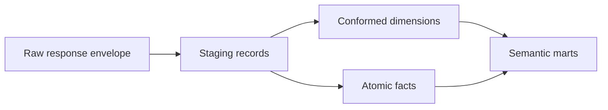

# Relational Warehouse Schema

## Purpose

Translate the ontology into a normalized operational store that preserves raw evidence and supports reproducible analytics.

## Overview

Load raw response envelopes first, then project normalized domain tables. Never let a convenience projection be the only retained source: endpoints evolve and historical corrections need replayable evidence.

## Table of Contents

1. Layers
2. Core tables
3. Temporal policy

| Layer | Tables | Rules |
|---|---|---|
| Raw | `raw_response`, `raw_payload` | endpoint, canonical parameter hash, fetched timestamp, body checksum, outcome |
| Identity | `country`, `league`, `team`, `player`, `venue`, `coach` | upsert on vendor ID; version mutable attributes |
| Scope | `league_season`, `team_season`, `round` | natural composite keys |
| Atomic facts | `fixture`, `fixture_event`, `fixture_player_stat`, `lineup_member`, `availability_observation`, `transfer` | retain source grain; immutable source key where supplied |
| Snapshots | `standing_snapshot`, `team_stat_snapshot`, `odds_quote`, `prediction_snapshot` | append by retrieval time and scope |

## Core Keys

| Table | Primary key | Natural uniqueness |
|---|---|---|
| `league_season` | surrogate or `(league_id, season)` | `(league_id, season)` |
| `fixture` | `fixture_id` | vendor fixture ID |
| `fixture_event` | surrogate | fixture + event order/type/team/player context where available |
| `transfer` | surrogate | player + date + source + destination + type; retain collision counter |
| `availability_observation` | surrogate | preserve source row; do not force player–fixture uniqueness |

## SCD Strategy

- Type 2: team/venue presentation attributes, player profile attributes, league metadata when historical display matters.
- Append-only snapshots: standings, team statistics, odds, predictions, live fixture state.
- Immutable facts with revisions: fixtures, events, lineups, and player statistics; retain `valid_from`, `valid_to`, and payload revision checksum.

## Indexing and Partitioning

Index foreign keys used in traversals: `fixture(league_id, season, date)`, `fixture_event(fixture_id)`, `fixture_player_stat(player_id, fixture_id)`, `availability_observation(player_id, fixture_id)`, and `transfer(player_id, transfer_date)`. Partition high-volume fact/snapshot tables by competition season or fixture date; compress raw JSON separately from query indexes.

## Known Semantic Boundary

The project’s `af_absence` table correctly retains an availability record at player–fixture grain. A spell table, if created, must be a derived table with its grouping rules and confidence explicitly stored.
